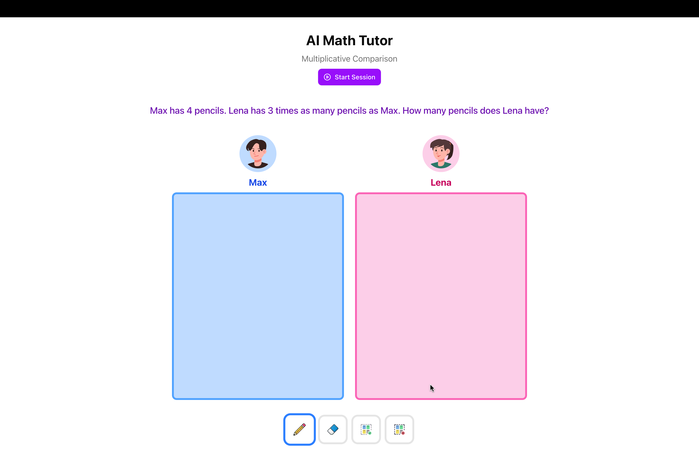

# ♾️ AI Math Tutor Concept

A concept AI math tutor inspired by the [Synthesis Tutor](https://www.synthesis.com/tutor) aimed at helping 4th graders learn [Multiplicative Comparison](https://accessim.org/k-5/grade-4/unit-5?a=teacher) through an interactive game.
